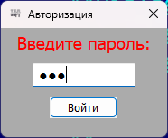
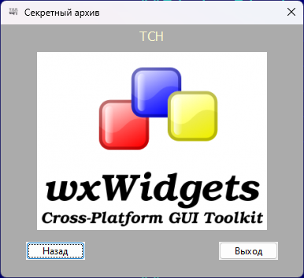

# DialogBlocks_win2
Пример двухоконной программы на C++ с использованием wxWidgets и DialogBlocks в Visual Studio 2022

## Настройки DialogBlocks:

**WXWIN:** D:\Development\CPP\wxWidgetsDBls

**DBPROJECTS:** D:\Projects\DialogBlocksProjects

**MSBUILDDIR:** C:\Program Files\Microsoft Visual Studio\2022\Community\MSBuild\Current\Bin

**MSVCDIR:**

* *Для сборки wxWidgets:* C:\Program Files\Microsoft Visual Studio\2022\Community\VC\Tools\MSVC\14.37.32822

* *Для сборки и запуска программ:* C:\Program Files\Microsoft Visual Studio\2022\Community

**PLATFORMSDK:** C:\Program Files (x86)\Windows Kits\10

**VC++ version:** 17

**VC++ tools version:** 17.7.6

**Full Platform SDK version**: 10.0.22621.0

**Message encoding:** cp866

## Ссылки:

http://www.anthemion.co.uk/dialogblocks/

https://www.wxwidgets.org/

https://visualstudio.microsoft.com/ru/vs/community/

http://www.anthemion.co.uk/dialogblocks/ImageBlocks-1.06-Setup.exe
